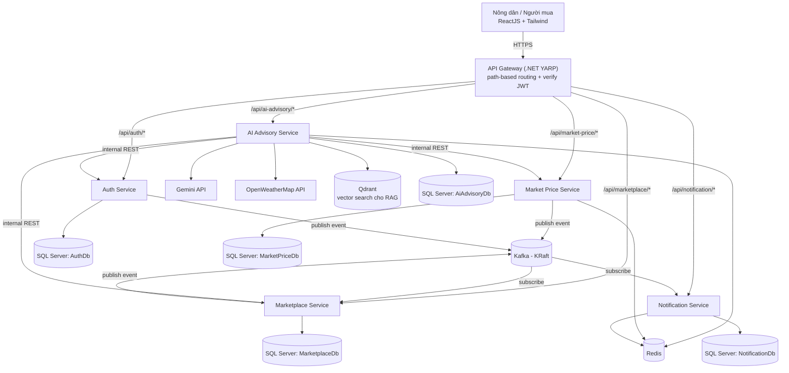

# Tổng quan kiến trúc

## 1. Sơ đồ tổng thể

Frontend (React) chỉ nói chuyện với một cổng public duy nhất — API Gateway. Gateway verify JWT tập trung rồi route theo tiền tố path tới đúng service nội bộ, kèm danh tính người dùng qua header tin cậy (xem [02-security-auth.md](02-security-auth.md#2-luồng-verify-token-liên-service)). Kafka, Redis, SQL Server, Qdrant nằm hoàn toàn trong mạng nội bộ Docker, không public ra ngoài.

AI Advisory Service là service **duy nhất** chủ động gọi service-to-service REST tới 3 service khác (Market Price/Marketplace/Auth Service) — ngoại lệ có chủ đích với nguyên tắc "hạn chế REST trực tiếp giữa 2 backend" ở mục 2 bên dưới, vì đây là chatbot function-calling cần dữ liệu **thật, tức thời** (giá/tin đăng/thông tin user) chứ không phải dữ liệu có thể duplicate cục bộ như model event-driven thông thường. Xem [services/ai-advisory-service.md](services/ai-advisory-service.md) và [data-flows/ai-chatbot-flow.md](data-flows/ai-chatbot-flow.md).

## 2. Nguyên tắc giao tiếp

- **Đồng bộ (REST/HTTPS)** — dùng cho mọi thao tác cần phản hồi ngay cho người dùng: đăng nhập, xem giá, đăng tin, gọi AI. Toàn bộ giao tiếp Frontend ↔ Service đi qua API Gateway bằng REST.
- **Bất đồng bộ (Kafka)** — chỉ dùng cho sự kiện "báo cho bên khác biết, không cần phản hồi ngay":
  - `market-price.price-changed.v1`
  - `marketplace.new-interest.v1`
  - `auth.user-updated.v1` — **đã setup** (Auth Service publish khi FullName/AvatarUrl đổi, Marketplace Service subscribe để đồng bộ lại dữ liệu denormalize; xem [services/auth-service.md](services/auth-service.md#kafka) và [services/marketplace-service.md](services/marketplace-service.md#kafka))
  - (optional) `auth.user-registered.v1`

  Frontend không bao giờ giao tiếp trực tiếp với Kafka.
- **Service-to-service REST trực tiếp** (đồng bộ giữa 2 backend service) bị hạn chế tối đa để tránh coupling chặt. Nếu service A cần dữ liệu của service B thường xuyên, ưu tiên:
  1. Frontend gọi cả hai service rồi ghép dữ liệu ở client, hoặc
  2. Service B publish event, service A giữ một bản sao cục bộ (data duplication có kiểm soát — đúng tinh thần microservices).

  Ví dụ áp dụng: Notification Service tự giữ bảng `PriceWatchSubscriptions` thay vì gọi ngược Market Price Service ở mỗi request.

## 3. Có cần API Gateway/BFF không?

**Quyết định (cập nhật): dùng full API Gateway**, xây bằng **.NET + YARP** (project `HappyFarmer.ApiGateway`, thư mục `src/Gateway/`), thay cho phương án Nginx reverse-proxy "dumb" ban đầu.

Gateway đảm nhiệm:
- **Routing** theo path prefix (`/api/{service-prefix}/*`) tới đúng service nội bộ — giữ nguyên convention cũ.
- **TLS termination** ở tầng production (VPS).
- **Xác thực JWT tập trung**: Gateway verify chữ ký + issuer/audience/lifetime (RS256, JWKS từ Auth Service, dùng lại `AddRemoteJwtAuthentication` trong `HappyFarmer.Shared.Contracts`). Token hợp lệ → Gateway gắn header danh tính rồi forward; token thiếu/sai → Gateway forward tiếp **không kèm header** (Gateway hiện không tự chặn theo route, xem ghi chú bên dưới), và service phía sau tự quyết định 401 qua `[Authorize]` vì không thấy header.
- **Forward danh tính** qua header nội bộ tin cậy (`X-User-Id`, `X-User-Role`, `X-User-Phone`) cho service phía sau đọc bằng `AddTrustedHeaderAuthentication` (đã migrate xong ở Auth Service + Market Price Service), thay vì mỗi service tự verify lại token — xem chi tiết luồng tại [02-security-auth.md](02-security-auth.md#2-luồng-verify-token-liên-service).

Lý do đổi quyết định:
- YARP là thư viện .NET chính thức của Microsoft, tận dụng được kiến thức .NET sẵn có của solution thay vì học thêm cú pháp `nginx.conf`.
- Xác thực JWT một chỗ duy nhất giúp tránh lặp lại logic JWT Bearer ở cả 5 service, dễ thêm rate-limiting/aggregation sau này (không cần đợi tới Phase 6+ như dự tính cũ).
- Vẫn đảm bảo một cổng public duy nhất (giải quyết CORS, giấu port nội bộ) — giống mô hình production thật.

**Trade-off cần lưu ý**: Gateway giờ là single point of failure về cả routing lẫn auth — nếu Gateway lỗi, toàn bộ hệ thống không truy cập được (trước đây mỗi service vẫn tự đứng độc lập nếu Nginx lỗi ở tầng khác). Chấp nhận đánh đổi này vì đơn giản hoá được auth logic đáng kể ở quy mô dự án hiện tại.

**Đã migrate xong**: Auth Service và Market Price Service không còn tự verify JWT — dùng `AddTrustedHeaderAuthentication` (cùng thư viện chung) để tin header do Gateway gắn. Việc này chỉ an toàn vì kiến trúc target không public 2 service này ra ngoài (chỉ Gateway gọi tới được); ở local dev do 2 service vẫn bind port ra host nên về lý thuyết có thể bị bypass nếu gọi thẳng port và tự gắn header — chấp nhận trade-off này ở dev, xem `CLAUDE.md`.

## 4. Service discovery ở mức Docker Compose

Không dùng Consul/Eureka/Kubernetes. Dùng chính DNS nội bộ của Docker Compose network: mỗi service có `container_name` cố định (`auth-service`, `market-price-service`, `ai-advisory-service`, `marketplace-service`, `notification-service`), các service khác gọi qua `http://<container_name>:8080`. Vì mạng Docker Compose là tĩnh trên single-host, không cần cơ chế discovery động.

## 5. Bảng ma trận giao tiếp

| Từ | Đến | Kiểu | Mục đích |
|---|---|---|---|
| Frontend | Tất cả service (qua API Gateway) | REST | CRUD, gọi AI |
| Market Price Service | Kafka topic `market-price.price-changed.v1` | Publish | Báo giá thay đổi |
| Marketplace Service | Kafka topic `marketplace.new-interest.v1` | Publish | Báo có người quan tâm tin đăng |
| Notification Service | 2 topic trên | Subscribe | Sinh thông báo, gửi kênh phù hợp |
| Auth Service | Kafka topic `auth.user-updated.v1` | Publish | Báo FullName/AvatarUrl thay đổi |
| Marketplace Service | Kafka topic `auth.user-updated.v1` | Subscribe | Đồng bộ lại FarmerName/BuyerName/avatar đã denormalize |
| API Gateway | Auth Service `.well-known/jwks.json` | REST (cache) | Lấy public key verify JWT tập trung — chỉ Gateway fetch, service phía sau không tự verify JWT nữa |
| AI Advisory Service | Market Price/Marketplace/Auth Service | REST (internal, resilience pipeline) | Chatbot function-calling tra giá/tin đăng/thông tin user thật — xem [services/ai-advisory-service.md](services/ai-advisory-service.md) |
| AI Advisory Service | Qdrant | REST/gRPC | Lưu + tìm kiếm vector embedding tài liệu nông nghiệp (RAG) — xem [data-flows/ai-chatbot-flow.md](data-flows/ai-chatbot-flow.md) |

Chi tiết từng service xem tại thư mục [services/](services/), chi tiết từng luồng sự kiện/AI xem tại [data-flows/](data-flows/).
