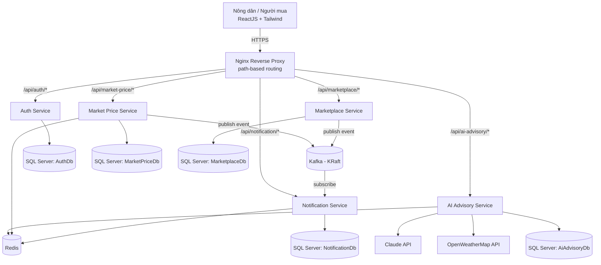

# Tổng quan kiến trúc

## 1. Sơ đồ tổng thể

Frontend (React) chỉ nói chuyện với một cổng public duy nhất — Nginx. Nginx route theo tiền tố path tới đúng service nội bộ. Kafka, Redis, SQL Server nằm hoàn toàn trong mạng nội bộ Docker, không public ra ngoài.

## 2. Nguyên tắc giao tiếp

- **Đồng bộ (REST/HTTPS)** — dùng cho mọi thao tác cần phản hồi ngay cho người dùng: đăng nhập, xem giá, đăng tin, gọi AI. Toàn bộ giao tiếp Frontend ↔ Service đi qua Nginx bằng REST.
- **Bất đồng bộ (Kafka)** — chỉ dùng cho sự kiện "báo cho bên khác biết, không cần phản hồi ngay":
  - `market-price.price-changed.v1`
  - `marketplace.new-interest.v1`
  - (optional) `auth.user-registered.v1`

  Frontend không bao giờ giao tiếp trực tiếp với Kafka.
- **Service-to-service REST trực tiếp** (đồng bộ giữa 2 backend service) bị hạn chế tối đa để tránh coupling chặt. Nếu service A cần dữ liệu của service B thường xuyên, ưu tiên:
  1. Frontend gọi cả hai service rồi ghép dữ liệu ở client, hoặc
  2. Service B publish event, service A giữ một bản sao cục bộ (data duplication có kiểm soát — đúng tinh thần microservices).

  Ví dụ áp dụng: Notification Service tự giữ bảng `PriceWatchSubscriptions` thay vì gọi ngược Market Price Service ở mỗi request.

## 3. Có cần API Gateway/BFF không?

**Quyết định: không dùng full API Gateway/BFF ở giai đoạn đầu.** Thay vào đó dùng **Nginx làm reverse proxy "dumb"**, chỉ đảm nhiệm 2 việc: routing theo path prefix và TLS termination.

Lý do:
- Dự án ở cấp độ học tập + demo thật, cần giữ độ phức tạp vừa đủ để thể hiện đúng chuẩn microservices mà không phình to.
- Nginx là một container nhẹ, không cần code thêm, cấu hình thuần qua `nginx.conf`.
- Vẫn đảm bảo một cổng public duy nhất (giải quyết CORS, giấu port nội bộ) — giống mô hình production thật.
- JWT được xác thực **ở từng service**, không tập trung ở gateway. Điều này đúng chuẩn microservices hơn (mỗi service tự chịu trách nhiệm bảo mật của chính nó), tránh biến gateway thành single point of failure về logic.

**Stretch-goal (Phase 6+, không bắt buộc):** nếu sau này muốn học BFF pattern, có thể thay Nginx bằng một service .NET dùng YARP, thêm rate-limiting và request aggregation. Việc này không phá vỡ thiết kế hiện tại vì convention routing (`/api/{service-prefix}/*`) đã nhất quán ngay từ đầu.

## 4. Service discovery ở mức Docker Compose

Không dùng Consul/Eureka/Kubernetes. Dùng chính DNS nội bộ của Docker Compose network: mỗi service có `container_name` cố định (`auth-service`, `market-price-service`, `ai-advisory-service`, `marketplace-service`, `notification-service`), các service khác gọi qua `http://<container_name>:8080`. Vì mạng Docker Compose là tĩnh trên single-host, không cần cơ chế discovery động.

## 5. Bảng ma trận giao tiếp

| Từ | Đến | Kiểu | Mục đích |
|---|---|---|---|
| Frontend | Tất cả service (qua Nginx) | REST | CRUD, gọi AI |
| Market Price Service | Kafka topic `market-price.price-changed.v1` | Publish | Báo giá thay đổi |
| Marketplace Service | Kafka topic `marketplace.new-interest.v1` | Publish | Báo có người quan tâm tin đăng |
| Notification Service | 2 topic trên | Subscribe | Sinh thông báo, gửi kênh phù hợp |
| Tất cả service | Auth Service `.well-known/jwks.json` | REST (cache) | Lấy public key verify JWT |

Chi tiết từng service xem tại thư mục [services/](services/), chi tiết từng luồng sự kiện/AI xem tại [data-flows/](data-flows/).
