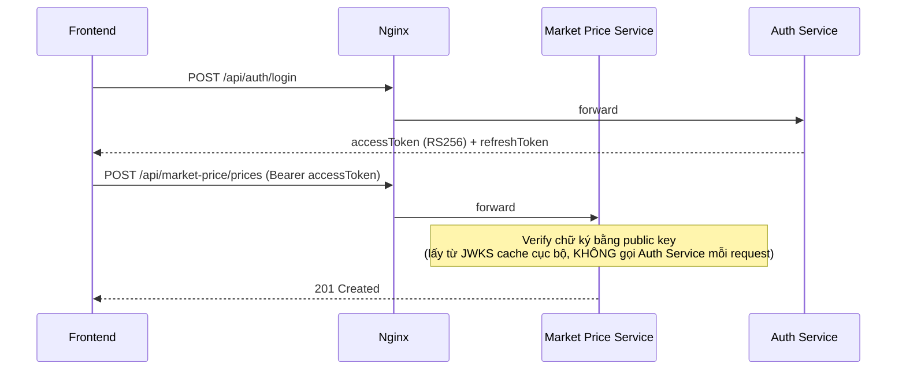

# Auth & bảo mật liên service

## 1. Thuật toán & luồng JWT

- Dùng **RS256 (asymmetric)** thay vì shared-secret HMAC: Auth Service giữ private key để ký token; các service khác chỉ cần **public key** để verify — đúng nguyên tắc microservices (không phân phối secret nhạy cảm ra nhiều service).
- Auth Service expose `GET /.well-known/jwks.json`. Các service khác cấu hình JWT Bearer middleware trỏ `Authority`/`MetadataAddress` vào endpoint này, middleware tự cache và refresh JWKS định kỳ.
- **Access token**: TTL ngắn (15–30 phút).
- **Refresh token**: TTL dài (7–30 ngày), lưu **hash** trong bảng `RefreshTokens` (AuthDb), rotate mỗi lần dùng (invalidate token cũ, cấp token mới) để chống replay.
- Claims chuẩn: `sub` (userId), `role` (Farmer/Buyer/Admin), `phone`/`email`, `jti`, `iat`, `exp`.

## 2. Luồng verify token liên service

Điểm quan trọng: **mỗi service tự verify token cục bộ (stateless)**, không gọi Auth Service theo từng request. Chỉ middleware JWKS mới cần fetch lại theo chu kỳ (vài giờ/lần, hoặc khi gặp `kid` không khớp cache).

## 3. Phân quyền (role-based)

| Vai trò | Có thể làm |
|---|---|
| Farmer | Nhập giá cộng đồng, đăng tin bán, dùng AI Advisory, xem/theo dõi giá |
| Buyer | Đăng yêu cầu mua, liên hệ tin đăng, xem giá |
| Admin | Duyệt giá cộng đồng, quản lý user, xem thống kê |

Áp dụng qua `[Authorize(Roles = "Farmer")]` (hoặc tương đương) ở từng controller/endpoint .NET. Chi tiết endpoint nào thuộc role nào xem trong từng file service tại [services/](services/).

## 4. Bảo mật khác

- **CORS**: chỉ cho phép origin của frontend (domain Vercel + localhost dev) tại từng service.
- **Secrets**: `.env` (gitignored) cho local, GitHub Actions Secrets cho CI/CD. Không commit API key (Claude, OpenWeatherMap) vào repo — chỉ commit `.env.example`.
- **Rate limit login**: đếm số lần đăng nhập sai qua Redis (`auth:ratelimit:login:{phoneOrIp}`), xem [auth-service.md](services/auth-service.md).
- **HTTPS bắt buộc** ở tầng Nginx trên VPS (Let's Encrypt/Certbot).
