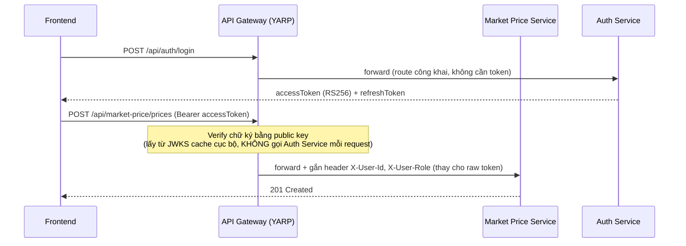

# Auth & bảo mật liên service

## 1. Thuật toán & luồng JWT

- Dùng **RS256 (asymmetric)** thay vì shared-secret HMAC: Auth Service giữ private key để ký token; các service khác chỉ cần **public key** để verify — đúng nguyên tắc microservices (không phân phối secret nhạy cảm ra nhiều service).
- Auth Service expose `GET /.well-known/jwks.json`. Chỉ **API Gateway** cấu hình JWT Bearer middleware trỏ vào endpoint này (tự cache và refresh JWKS định kỳ) — các service phía sau (Auth Service, Market Price Service) không tự verify JWT nữa, xem mục 2.
- **Access token**: TTL ngắn (15–30 phút).
- **Refresh token**: TTL dài (7–30 ngày), lưu **hash** trong bảng `RefreshTokens` (AuthDb), rotate mỗi lần dùng (invalidate token cũ, cấp token mới) để chống replay.
- Claims chuẩn: `sub` (userId), `role` (Farmer/Buyer/Admin), `phone`/`email`, `jti`, `iat`, `exp`.

## 2. Luồng verify token liên service

Điểm quan trọng: **API Gateway verify token tập trung, stateless** (RS256, JWKS cache cục bộ), không gọi Auth Service theo từng request — chỉ middleware JWKS ở Gateway mới cần fetch lại theo chu kỳ (vài giờ/lần, hoặc khi gặp `kid` không khớp cache). Sau khi verify, Gateway gắn danh tính người dùng vào header nội bộ (`X-User-Id`, `X-User-Role`, `X-User-Phone`) rồi mới forward — service phía sau (Auth Service, Market Price Service) đọc các header này qua `AddTrustedHeaderAuthentication` (`HappyFarmer.Shared.Contracts/Auth/TrustedHeaderAuthenticationHandler.cs`), **không tự verify chữ ký JWT nữa**. Model này chỉ an toàn vì mạng Docker nội bộ không public, chỉ Gateway mới có đường vào từ ngoài (xem [01-overview.md](01-overview.md#2-networking) — chỉ container gateway expose port ra host); ở local dev do 2 service vẫn bind port ra host nên về lý thuyết bị bypass được nếu gọi thẳng port và tự gắn header — trade-off chấp nhận ở dev, xem `CLAUDE.md`.

**Route công khai** (không yêu cầu đăng nhập, ví dụ `/api/auth/register`, `/api/auth/login`, `/api/market-price/prices` xem giá) vẫn khai báo bằng `[AllowAnonymous]`/không gắn `[Authorize]` ở từng controller như trước — Gateway không tự chặn theo route (forward mọi request, có gắn header hay không tuỳ token hợp lệ hay không), việc quyết định endpoint nào cần đăng nhập vẫn nằm ở service như kiến trúc cũ, chỉ khác nguồn danh tính (header thay vì tự verify token).

## 3. Phân quyền (role-based)

| Vai trò | Có thể làm |
|---|---|
| Farmer | Nhập giá cộng đồng, đăng tin bán, dùng AI Advisory, xem/theo dõi giá |
| Buyer | Đăng yêu cầu mua, liên hệ tin đăng, xem giá |
| Admin | Duyệt giá cộng đồng, quản lý user, xem thống kê |

Áp dụng qua `[Authorize(Roles = "Farmer")]` (hoặc tương đương) ở từng controller/endpoint .NET. Chi tiết endpoint nào thuộc role nào xem trong từng file service tại [services/](services/).

## 4. Bảo mật khác

- **CORS**: chỉ cho phép origin của frontend (domain Vercel + localhost dev) tại API Gateway — browser chỉ gọi tới Gateway nên về nguyên tắc các service phía sau không cần tự cấu hình CORS nữa (Auth Service/Market Price Service hiện vẫn còn `Cors:AllowedOrigins`/`AddCors` cũ trong code, chưa dọn — vô hại vì không được gọi trực tiếp từ browser, nhưng có thể bỏ khi dọn dẹp sau này).
- **Secrets**: `.env` (gitignored) cho local, GitHub Actions Secrets cho CI/CD. Không commit API key (Claude, OpenWeatherMap) vào repo — chỉ commit `.env.example`.
- **Rate limit login**: đếm số lần đăng nhập sai qua Redis (`auth:ratelimit:login:{phoneOrIp}`), xem [auth-service.md](services/auth-service.md).
- **HTTPS bắt buộc** ở tầng API Gateway trên VPS (Let's Encrypt/Certbot).
