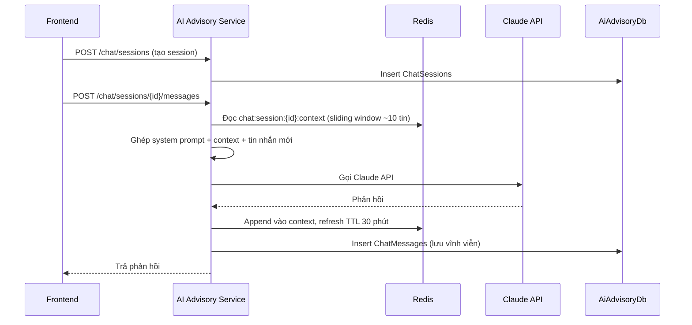

# Luồng: Chatbot tư vấn (AI Chat)

Thuộc [AI Advisory Service](../services/ai-advisory-service.md).

## Luồng xử lý



## System prompt — nguyên tắc

Giọng điệu tiếng Việt gần gũi, dễ hiểu, dùng từ ngữ quen thuộc với nông dân, tránh thuật ngữ kỹ thuật/công nghệ. Persona: người tư vấn nông nghiệp thân thiện, kiên nhẫn.

## Input

```json
{ "sessionId": "...", "message": "Cây lúa nhà tôi bị vàng lá phải làm sao?" }
```

## Output

```json
{ "sessionId": "...", "reply": "...", "timestamp": "..." }
```

## Ghi chú

- Redis (`chat:session:{sessionId}:context`) là nguồn context chính khi hội thoại đang hoạt động — nhanh, không cần query DB mỗi lần.
- `ChatMessages` trong DB là bản lưu vĩnh viễn, dùng khi Redis hết hạn (>30 phút không hoạt động) hoặc để xem lại lịch sử qua `GET /chat/sessions/{id}/messages`.
- Áp dụng rate limit theo `ai:ratelimit:{userId}:{date}` (xem [ai-advisory-service.md](../services/ai-advisory-service.md#redis)) để kiểm soát chi phí gọi Claude API.
