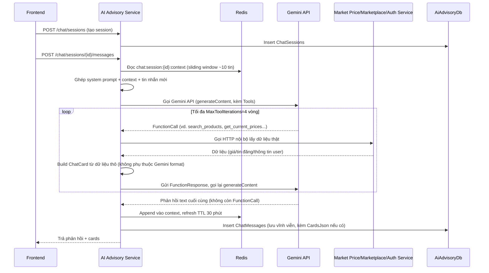

# Luồng: Chatbot tư vấn (AI Chat)

Thuộc [AI Advisory Service](../services/ai-advisory-service.md).

## Luồng xử lý



## System prompt — nguyên tắc

- **Giọng điệu**: tiếng Việt gần gũi, dễ hiểu, dùng từ ngữ quen thuộc với nông dân, tránh thuật ngữ kỹ thuật/công nghệ. Persona: người tư vấn nông nghiệp thân thiện, kiên nhẫn.
- **Ranh giới chủ đề**: chỉ trả lời câu hỏi liên quan nông nghiệp/canh tác/sâu bệnh/thời tiết mùa vụ/giá nông sản. Câu hỏi ngoài phạm vi (chính trị, sức khỏe con người, lập trình, giải trí...) → từ chối lịch sự, gợi ý quay lại chủ đề canh tác, không cố trả lời.
- **Hỏi lại khi thiếu thông tin**: nếu tin nhắn chưa đủ dữ kiện để tư vấn chính xác (chưa rõ loại cây trồng, triệu chứng cụ thể, khu vực/mùa vụ) → hỏi lại 1 câu làm rõ thay vì đoán và đưa lời khuyên chung chung.

Cả 3 nguyên tắc trên được viết cố định trong system prompt tại `GeminiChatService.cs` (AI Advisory Service).

## Function-calling — tra dữ liệu thật của hệ thống

Chatbot có 7 tool (Gemini function-calling, `Tools`/`FunctionDeclaration` của SDK `Google.GenAI`):

| Tool | Mục đích |
|---|---|
| `search_products` | Tìm `productId` chính xác theo tên nông sản (gọi Market Price Service) |
| `search_regions` | Tìm `regionId` chính xác theo tên khu vực/tỉnh |
| `get_current_prices` | Giá hiện tại theo `productId`/`regionId` |
| `get_price_trend` | Top biến động giá mạnh nhất gần đây |
| `get_price_history` | Lịch sử giá ~3 tháng của 1 sản phẩm |
| `search_marketplace_listings` | Tìm tin đăng bán trên Chợ nông sản (gọi Marketplace Service) |
| `get_my_profile` | Tên + tỉnh/thành đã đăng ký của user đang chat (gọi Auth Service) |

**Nguyên tắc quan trọng**: `get_current_prices`/`get_price_history`/`search_marketplace_listings`
chỉ nhận **ID dạng số** (`productId`/`regionId`), không nhận tên tự do. Khi người dùng nhắc tên
bằng chữ, Gemini **bắt buộc** gọi `search_products`/`search_regions` trước để lấy đúng ID — nếu kết
quả tìm kiếm mơ hồ (nhiều sản phẩm trùng tên), Gemini tự thấy danh sách ứng viên và có thể hỏi lại
người dùng thay vì bị backend âm thầm đoán/lấy kết quả đầu tiên (thiết kế cũ, đã bỏ). Vòng lặp
tool-call giới hạn `MaxToolIterations = 4` để tránh treo request nếu Gemini gọi tool liên tục.

Card hiển thị (`PriceCard`/`ListingCard`) do **backend tự build** từ dữ liệu thô các service trả
về — không phụ thuộc Gemini tự format JSON, tránh model bịa số liệu khi "tường thuật" lại kết quả.
`get_my_profile` không tự động áp `provinceId` của user vào các tool khác — chỉ cung cấp tên tỉnh để
Gemini tự quyết định dùng làm khu vực mặc định (qua `search_regions`) hay hỏi lại người dùng.

## Input

```json
{ "sessionId": "...", "message": "Cây lúa nhà tôi bị vàng lá phải làm sao?" }
```

## Output

```json
{
  "sessionId": "...",
  "reply": "...",
  "timestamp": "...",
  "cards": [
    { "type": "price", "productId": 1, "productName": "...", "regionName": "...", "currentPrice": 12000, "changePercent": null, "unit": "1kg", "url": "..." },
    { "type": "listing", "listingId": 1, "productName": "...", "regionName": "...", "pricePerUnit": 10000, "quantity": 100, "unit": "kg", "imageUrl": "...", "farmerName": "...", "url": "..." }
  ]
}
```

`cards` là `null` nếu lượt chat đó không tra dữ liệu gì qua function-calling (câu hỏi tư vấn chung chung).

## Ghi chú

- Redis (`chat:session:{sessionId}:context`) là nguồn context chính khi hội thoại đang hoạt động — nhanh, không cần query DB mỗi lần.
- `ChatMessages` trong DB là bản lưu vĩnh viễn, dùng khi Redis hết hạn (>30 phút không hoạt động) hoặc để xem lại lịch sử qua `GET /chat/sessions/{id}/messages`.
- Áp dụng rate limit theo `ai:ratelimit:{userId}:{date}` (xem [ai-advisory-service.md](../services/ai-advisory-service.md#redis)) để kiểm soát chi phí gọi Gemini API — check **trước** khi gọi Gemini, không gọi nếu đã vượt quota.
- **Kiểm soát tải ở tầng hệ thống** (tách biệt với quota/ngày ở trên): endpoint `POST /chat/sessions/{id}/messages` dùng `Microsoft.AspNetCore.RateLimiting` (built-in .NET, không cần package riêng) với policy `AddConcurrencyLimiter` — giới hạn số lượt gọi Gemini đồng thời (`Gemini:MaxConcurrentRequests`, mặc định 5), request vượt giới hạn sẽ **xếp hàng** (`QueueProcessingOrder.OldestFirst`, `Gemini:ConcurrencyQueueLimit` mặc định 50) thay vì bị từ chối ngay, chỉ trả `503` khi hàng đợi đầy. Không dùng message broker/Kafka cho việc này (over-engineering cho quy mô hiện tại).
- Gọi Gemini qua package chính thức `Google.GenAI` (API `generateContent`, không dùng "Interactions API" mới hơn vì SDK C# chưa hỗ trợ — xem `Services/GeminiChatService.cs`), model mặc định `gemini-3.1-flash-lite` (cấu hình qua `Gemini:Model` — `gemini-2.5-flash` không còn khả dụng cho tài khoản mới tạo; đổi từ `gemini-3.5-flash` sang bản lite vì model mới hay bị quá tải/nghẽn capacity phía Google). Bắt riêng `ClientError` (4xx, gồm rate-limit) và `ServerError` (5xx) của SDK để trả message tiếng Việt thân thiện thay vì để lỗi bung ra.
- Refusal/an toàn nội dung: nếu Gemini không trả về `Candidates` hoặc `PromptFeedback.BlockReason` có giá trị → coi là bị chặn, trả message xin lỗi tiếng Việt (tương đương check `StopReason == "refusal"` khi còn dùng Claude).
- Lỗi khi gọi Market Price/Marketplace/Auth Service (network/timeout) không làm sập cả lượt chat — mỗi client (`MarketPriceServiceClient`/`MarketplaceServiceClient`/`AuthServiceClient`) nuốt lỗi, trả rỗng/`null`, tool handler biến thành `{"error": "..."}` trong `FunctionResponse` để Gemini tự trả lời người dùng lịch sự thay vì bịa số liệu. 3 `HttpClient` này có resilience pipeline (`Microsoft.Extensions.Http.Resilience`) retry + circuit-breaker + timeout, xem [ai-advisory-service.md](../services/ai-advisory-service.md).
