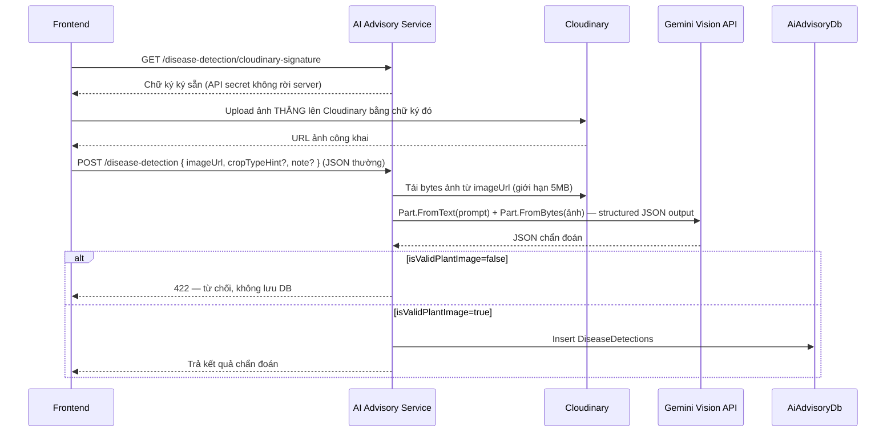

# Luồng: Nhận diện bệnh cây trồng (AI Vision)

Thuộc [AI Advisory Service](../services/ai-advisory-service.md).

## Luồng xử lý — ảnh không gửi thẳng lên backend



**Vì sao ảnh không gửi thẳng lên backend**: nhất quán với cách Marketplace Service đã làm (Cloudinary
signed-upload) — frontend upload trực tiếp lên Cloudinary, backend chỉ ký request (API secret không rời
server) rồi nhận lại 1 URL, không phải xử lý multipart. Gemini Vision cần bytes ảnh thật (`Part.FromBytes`),
không dùng `Part.FromUri` vì property này chỉ dành cho GCS URI theo tài liệu SDK, không an toàn/được hỗ trợ
cho URL Cloudinary công khai — nên backend tự tải lại bytes từ URL đó trước khi gọi Gemini.

## Nguyên tắc thiết kế — không giới hạn theo danh sách cây trồng, 3 nhánh kết quả

Giống harvest prediction: **không seed danh sách cây được hỗ trợ** — Gemini Vision tự nhận diện cây gì
từ ảnh bằng kiến thức chung, không cần model chuyên biệt/Python sidecar (SCOLD và sau đó
`prithivMLmods/Rice-Leaf-Disease` đã từng thử nhưng bị bỏ — rice-only, không mở rộng được, và phần code
hybrid đó cũng chưa từng được commit, đã mất khi đổi hướng).

**3 nhánh kết quả rõ ràng** (khác thiết kế cũ chỉ có 2 nhánh mơ hồ "chẩn đoán được"/"diseaseName: null"):

1. **`isValidPlantImage=false`**: ảnh không phải cây trồng thật hoặc quá mờ/sai bộ phận → **từ chối hẳn
   (422), không lưu DB** — cùng nguyên tắc `isRecognizedCrop` đã áp dụng cho harvest prediction (tránh
   Gemini "đoán đại" cho input vô nghĩa).
2. **`isValidPlantImage=true, isHealthy=true`**: cây khỏe mạnh, không phát hiện bệnh — vẫn là **kết quả
   hợp lệ**, `diseaseName=null`, có thể kèm vài `preventionTips` chung.
3. **`isValidPlantImage=true, isHealthy=false`**: phát hiện bệnh/sâu hại — chẩn đoán đầy đủ.

**Bẫy đã tránh** (đã gặp thật khi làm harvest prediction, áp dụng lại ở đây): `ResponseSchema` **không để
field nào là nullable/optional** — mọi field đều `Required`, kể cả khi `isValidPlantImage=false` (lúc đó
Gemini điền placeholder vô hại: `isHealthy=false`, `identifiedCropType="Không xác định"`,
`confidenceScore=0`, danh sách rỗng `[]`) rồi backend đọc `isValidPlantImage` trước để quyết định dùng
hay bỏ toàn bộ phần còn lại. Từng thử để field nullable + bỏ khỏi `Required` và Gemini bỏ trống **cả với
input hợp lệ** — không đáng tin cậy.

## Input

```json
{ "imageUrl": "https://res.cloudinary.com/.../disease-photos/xyz.jpg", "cropTypeHint": "Cà chua (optional)", "note": "optional" }
```

## Output

```json
{
  "id": 1,
  "imageUrl": "https://res.cloudinary.com/.../disease-photos/xyz.jpg",
  "isHealthy": false,
  "identifiedCropType": "Cà chua",
  "diseaseName": "Bệnh mốc sương",
  "confidenceScore": 0.87,
  "severity": "Trung bình",
  "description": "...",
  "treatmentOrganic": ["..."],
  "treatmentChemical": ["..."],
  "preventionTips": ["..."],
  "recommendedActions": ["..."],
  "createdAt": "..."
}
```

Ảnh không hợp lệ → HTTP 422:

```json
{ "message": "Ảnh không đủ rõ hoặc không phải ảnh cây trồng. Vui lòng chụp cận cảnh...", "description": "..." }
```

## Ghi chú

- Model đọc từ `Gemini:Model` (dùng chung với 2 luồng kia, hiện `gemini-3.1-flash-lite`) — cùng
  `ThinkingConfig.ThinkingBudget = 0` (tắt thinking, không cần cho tác vụ này).
- Giới hạn ảnh tải về 5MB (kiểm tra cả `Content-Length` header lẫn số byte thực tải về, tránh URL trả
  sai header).
- Quota/ngày (`Gemini:DiseaseDetectionDailyLimitPerUser`, mặc định 10) **tách riêng** với quota chat/harvest
  — key Redis `ai:ratelimit:disease:{userId}:{date}`. Concurrency limiter (`Microsoft.AspNetCore.RateLimiting`,
  policy `"gemini"`) **dùng chung** với 2 luồng kia vì cùng chia sẻ giới hạn thật của 1 tài khoản Gemini.
- Lỗi từ Gemini (refusal, `ServerError`, `ClientError`) trả 503 kèm message tiếng Việt thân thiện — không
  lưu DB khi thất bại. Ảnh tải không được (URL sai/quá lớn) trả 400, không gọi Gemini.
- Vòng này chỉ có backend — test qua `.http`/Swagger (dùng tạm 1 `imageUrl` công khai bất kỳ, không bắt
  buộc phải qua bước ký Cloudinary thật để test logic chẩn đoán). Frontend (form upload ảnh qua Cloudinary
  + hiển thị kết quả) làm ở vòng sau.
