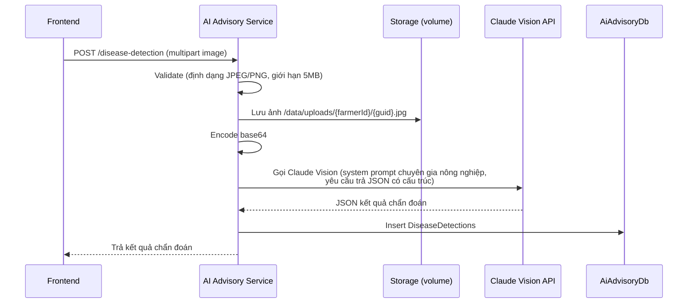

# Luồng: Nhận diện bệnh cây trồng (AI Vision)

Thuộc [AI Advisory Service](../services/ai-advisory-service.md).

## Luồng xử lý



## Input (request)

```json
{ "image": "<multipart file>", "cropType": "Cà chua (optional)", "note": "optional" }
```

## Output (response) — cũng là `AnalysisResultJson` lưu trong DB

```json
{
  "diseaseName": "Bệnh mốc sương",
  "confidenceScore": 0.87,
  "severity": "Trung bình",
  "description": "...",
  "treatmentOrganic": ["..."],
  "treatmentChemical": ["..."],
  "preventionTips": ["..."],
  "recommendedActions": ["..."]
}
```

## Xử lý lỗi / trường hợp không nhận diện được

Nếu Claude không nhận diện được bệnh hoặc ảnh không đủ rõ, trả về:

```json
{ "diseaseName": null, "description": "Không đủ dữ liệu, vui lòng chụp rõ hơn" }
```

## Ghi chú

- Prompt hệ thống nên cố định persona "chuyên gia nông nghiệp Việt Nam", yêu cầu Claude trả JSON đúng schema trên (structured output/tool-use) để parse an toàn.
- Ảnh lưu theo path `/data/uploads/{farmerId}/{guid}.jpg`, serve qua static file middleware hoặc CDN ở giai đoạn sau.
