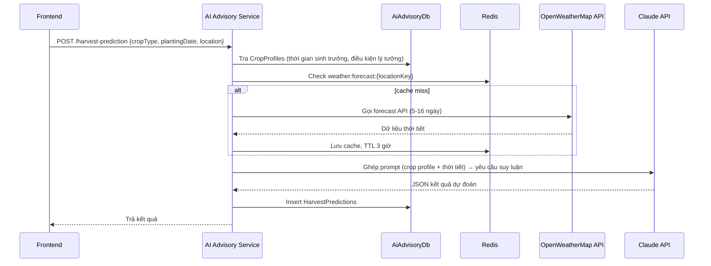

# Luồng: Dự đoán thời điểm thu hoạch (AI Harvest Prediction)

Thuộc [AI Advisory Service](../services/ai-advisory-service.md).

## Luồng xử lý



## Input

```json
{ "cropType": "Lúa", "plantingDate": "2026-06-01", "location": "Cần Thơ" }
```

## Output

```json
{
  "recommendedHarvestStartDate": "2026-09-10",
  "recommendedHarvestEndDate": "2026-09-17",
  "confidenceLevel": "Cao",
  "riskFactors": ["Mưa lớn dự báo ngày 15/09"],
  "reasoning": "...",
  "weatherSummary": { "avgTemp": 28, "totalRainfallMm": 45 }
}
```

## Ghi chú

- `CropProfiles` cung cấp baseline (thời gian sinh trưởng trung bình, nhiệt độ/lượng mưa lý tưởng) — xem schema tại [ai-advisory-service.md](../services/ai-advisory-service.md#db-schema-aiadvisorydb).
- Cache thời tiết theo `weather:forecast:{locationKey}` bắt buộc để tránh vượt rate limit free tier của OpenWeatherMap.
- Claude nhận cả crop profile lẫn dữ liệu thời tiết trong prompt để suy luận thời điểm thu hoạch tối ưu và các rủi ro liên quan (mưa lúc thu hoạch, hạn hán...).
