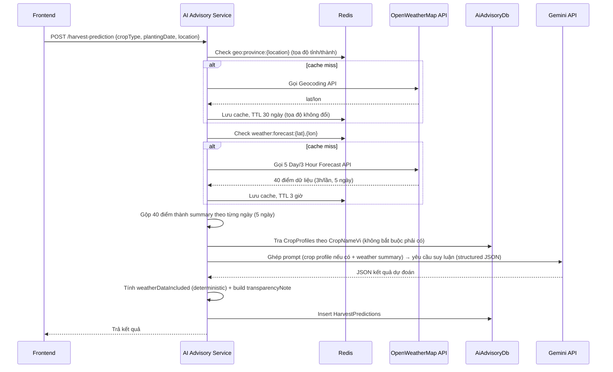

# Luồng: Dự đoán thời điểm thu hoạch (AI Harvest Prediction)

Thuộc [AI Advisory Service](../services/ai-advisory-service.md).

## Luồng xử lý



## Nguyên tắc thiết kế quan trọng — không giới hạn theo danh sách cây trồng

Bản thiết kế ban đầu định seed `CropProfiles` như một danh mục cây trồng bắt buộc (chỉ dự đoán được cho cây có trong danh sách) — bị bỏ vì **farmer không chỉ hỏi về 1-2 loại cây**. Thiết kế hiện tại:

- `CropProfiles` chỉ là bảng **override tùy chọn**, hiện chỉ seed 1 dòng: **Lúa** (cây lương thực chủ lực, đáng có số liệu nông học đã kiểm chứng riêng — `AvgDaysToHarvest`/`IdealTempMin-Max`/`IdealRainfallMm`, xem migration `SeedCropProfiles`).
- Cây trồng **không có** trong `CropProfiles` vẫn được dự đoán bình thường — Gemini tự dùng kiến thức nông học chung trong prompt (giống cách chatbot đã tin tưởng Gemini trả lời về bất kỳ cây trồng nào).
- Cây lâu năm (xoài, cà phê, hồ tiêu...) không có field riêng (`flowerDate`) — hướng dẫn trong system prompt yêu cầu Gemini tự nhận biết "ngày trồng" không phản ánh đúng chu kỳ ra hoa/thu hoạch của cây lâu năm và tự suy luận theo mùa vụ hợp lý.
- Response **luôn kèm `usedVerifiedCropProfile`** (bool) để farmer biết dữ liệu có phải là số liệu đã kiểm chứng hay AI tự ước tính.

## Giới hạn thật của OpenWeatherMap free tier — chỉ 5 ngày, không phải 16

Gói **free tier** của OpenWeatherMap chỉ có "5 Day/3 Hour Forecast" (dự báo 5 ngày tới, bước 3 giờ/lần) — "16 Day Daily Forecast" là sản phẩm **riêng**, thường cần gói trả phí. Vì vậy:

- Hệ thống **luôn** fetch dự báo 5 ngày cho khu vực (không tốn thêm gì, free tier cho phép 1.000.000 lượt gọi/tháng), gộp thành summary theo ngày, đưa vào prompt cho Gemini.
- Ngày thu hoạch dự kiến (`recommendedStartDate` Gemini trả về) có thể **nằm ngoài** phạm vi 5 ngày đã fetch (vd. farmer hỏi ngay lúc mới trồng, còn ~100 ngày nữa mới thu hoạch) — khi đó dữ liệu thời tiết không còn ý nghĩa để đánh giá rủi ro.
- `weatherDataIncluded` (bool) được **tính xác định trong code** (so sánh `recommendedStartDate` với ngày xa nhất đã fetch được), **không phải Gemini tự đánh giá** — đảm bảo tính nhất quán, kiểm chứng được.

## Input

```json
{ "cropType": "Lúa", "plantingDate": "2026-06-01", "location": "Cần Thơ" }
```

## Output

```json
{
  "id": 1,
  "cropType": "Lúa",
  "plantingDate": "2026-06-01",
  "location": "Cần Thơ",
  "recommendedStartDate": "2026-09-10",
  "recommendedEndDate": "2026-09-17",
  "confidenceLevel": "Cao",
  "riskFactors": ["Mưa lớn dự báo ngày 15/09"],
  "reasoning": "...",
  "weatherSummary": { "avgTempC": 28, "totalRainfallMm": 45 },
  "usedVerifiedCropProfile": true,
  "weatherDataIncluded": true,
  "transparencyNote": "Dự đoán dựa trên số liệu nông học đã kiểm chứng và dữ liệu thời tiết thực tế.",
  "createdAt": "..."
}
```

`transparencyNote` có 4 biến thể cố định (build trong code, không phải Gemini tự viết) theo tổ hợp `usedVerifiedCropProfile` × `weatherDataIncluded` — xem `HarvestPredictionController.BuildTransparencyNote`.

## Ghi chú

- Structured output: gọi Gemini qua `GenerateContentConfig.ResponseSchema` (Google.GenAI SDK) để ép trả đúng JSON schema (ngày, mức tin cậy, danh sách rủi ro, giải thích) — khác với chatbot (chỉ trả text tự do), vì kết quả này cần parse chính xác để lưu DB.
- Quota/ngày (`Gemini:HarvestPredictionDailyLimitPerUser`, mặc định 10) **tách riêng** với quota chat (`Gemini:DailyMessageLimitPerUser`) — key Redis `ai:ratelimit:harvest:{userId}:{date}` — dùng hết quota chat không ảnh hưởng harvest-prediction và ngược lại.
- Concurrency limiter (`Microsoft.AspNetCore.RateLimiting`, policy `"gemini"`) **dùng chung** với chatbot vì cả 2 chia sẻ giới hạn thật của cùng 1 tài khoản Gemini.
- Lỗi từ Gemini (refusal, `ServerError`, `ClientError`) trả về HTTP 503 kèm message tiếng Việt thân thiện — không lưu DB khi thất bại.
- Vòng này chỉ có backend (API + DB + Redis + OpenWeatherMap) — test qua `.http`/Swagger, chưa có frontend.
