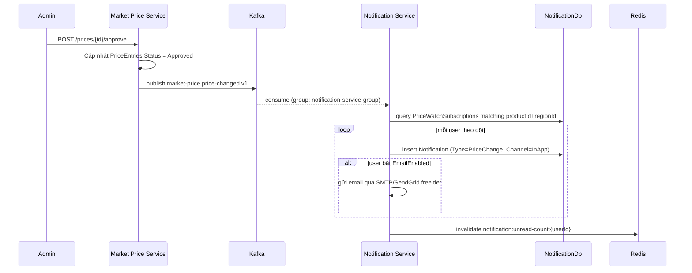

# Luồng: Market Price → Notification

## Chi tiết

- **Publisher**: [Market Price Service](../services/market-price-service.md), ngay sau khi một `PriceEntries` được set `Approved` (dù nguồn là Admin duyệt cộng đồng hay crawler auto-approve).
- **Subscriber**: [Notification Service](../services/notification-service.md), dùng consumer group riêng (`notification-service-group`) để đảm bảo khi scale ngang sau này không nhận trùng message.
- **Kênh gửi**:
  - In-app: luôn tạo, bắt buộc MVP.
  - Email: Phase 4, dùng SMTP miễn phí (Gmail SMTP hoặc SendGrid free tier ~100 email/ngày), chỉ gửi nếu `NotificationPreferences.EmailEnabled = true`.
  - Push notification (Web Push/FCM): stretch goal Phase 6, không nằm trong MVP vì cần thêm hạ tầng (service worker, VAPID keys).
- **Idempotency**: payload Kafka có `eventId` — Notification Service dùng để tránh xử lý trùng nếu Kafka redeliver message (Kafka đảm bảo at-least-once, không phải exactly-once).

## Payload sự kiện

Định nghĩa đầy đủ tại [../services/market-price-service.md](../services/market-price-service.md#kafka) — topic `market-price.price-changed.v1`.
